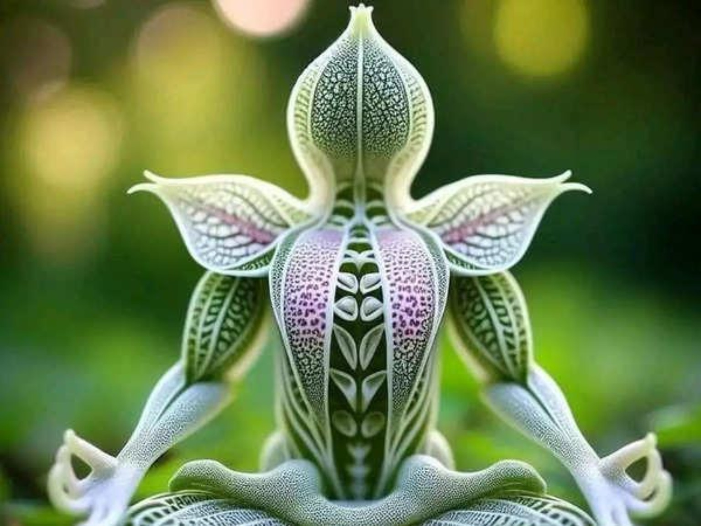

# 🌌 Aurora Borealis Website - Complete Setup & Customization Guide

**GitHub Gist for Shiva's Reset Retreat Website**

---

## 📋 Quick Start

### Local Development
```bash
git clone https://github.com/Ashoka36/aurora-retreat.git
cd aurora-retreat
python3 -m http.server 8000
# Open http://localhost:8000
```

---

## 🎨 Customization Snippets

### 1. Replace Logo
```html
<!-- In index.html, find this line: -->


<!-- Replace with your logo: -->

```

### 2. Update WhatsApp Contact
```html
<!-- Find the CTA button and update: -->
<a href="https://wa.me/917676432449" class="cta-button" target="_blank">
    📱 Book Your Retreat
</a>

<!-- Change to your number: -->
<a href="https://wa.me/YOUR_PHONE_NUMBER" class="cta-button" target="_blank">
    📱 Book Your Retreat
</a>
```

### 3. Replace Section Images
```html
<!-- Yoga Section -->

<!-- Change to: -->


<!-- Restopub Section -->

<!-- Change to: -->


<!-- Bhajan Section -->

<!-- Change to: -->


<!-- Pet Parents Section -->

<!-- Change to: -->


<!-- Gallery Section -->

<!-- Change to: -->

```

### 4. Customize Aurora Colors
```css
/* In styles.css, find and update :root variables: */
:root {
    --aurora-green: #00ff88;      /* Primary green accent */
    --aurora-cyan: #7df9ff;       /* Cyan/light blue accent */
    --aurora-purple: #ff00ff;     /* Purple/magenta accent */
    --aurora-pink: #ff7fdb;       /* Pink text accent */
    --aurora-blue: #1a4d5c;       /* Dark blue background tint */
    --dark-bg: #0a0e27;           /* Main dark background */
    --dark-secondary: #1a2d5c;    /* Secondary dark background */
    --text-light: #e0e0e0;        /* Light gray text */
    --text-white: #ffffff;        /* White text */
}
```

### 5. Update Section Content
```html
<!-- Edit text directly in index.html: -->

<!-- Hero Section -->
<h1 class="hero-title">SHIVA'S RESET RETREAT</h1>
<h3 class="hero-subtitle">Palolem • Goa • India</h3>
<p class="tagline">Reset your Mind, Body & Soul</p>

<!-- Section Titles -->
<h2>Reset the Mind. Reclaim the Soul.</h2>
<h3 class="section-subtitle">Discover Tantra — where calm tides roll.</h3>
<p class="section-text">Your custom description here</p>
```

### 6. Update Contact Information
```html
<!-- In footer, update: -->
<p>&copy; 2024 Shiva's Reset Retreat. All rights reserved.</p>
<p>Palolem, Goa - India | <a href="https://wa.me/917676432449">WhatsApp</a></p>

<!-- Change phone number in CTA section: -->
<p class="cta-secondary">or call +44 7557431871</p>
```

---

## 🚀 GitHub Pages Deployment

### Step 1: Create Repository
```bash
cd aurora-retreat
git init
git add .
git commit -m "Initial commit: Aurora Borealis website"
git branch -M main
git remote add origin https://github.com/YOUR_USERNAME/aurora-retreat.git
git push -u origin main
```

### Step 2: Enable GitHub Pages
1. Go to repository Settings
2. Scroll to "Pages" section
3. Under "Source", select "Deploy from a branch"
4. Choose `main` branch
5. Click Save

### Step 3: Access Your Website
```
https://YOUR_USERNAME.github.io/aurora-retreat/
```

### Step 4: Push Updates
```bash
git add .
git commit -m "Update: Added custom images"
git push origin main
# Website updates automatically!
```

---

## 📱 Mobile Responsiveness

The website includes responsive breakpoints:

```css
/* Desktop: 1024px and above */
/* Tablet: 768px to 1023px */
/* Mobile: 480px to 767px */
/* Small Mobile: Below 480px */
```

**Test on Mobile:**
```bash
# Find your computer IP
ipconfig getifaddr en0  # macOS
hostname -I            # Linux

# Access from phone on same network
http://YOUR_COMPUTER_IP:8000
```

---

## 📁 Recommended File Structure

```
aurora-retreat/
├── index.html              # Main HTML file
├── styles.css              # All styling & animations
├── script.js               # Mobile menu & interactions
├── logo.jpg                # Your retreat logo
├── README.md               # Project documentation
├── INSTALLATION.md         # Setup & deployment guide
├── GIST.md                 # This file
└── images/                 # Your photos folder
    ├── yoga.jpg            # Yoga/meditation photo
    ├── restopub.jpg        # Restopub/boba bar photo
    ├── bhajan.jpg          # Bhajan/concert photo
    ├── pets.jpg            # Pet parent photo
    └── gallery.jpg         # Gallery/collage photo
```

**Create images folder:**
```bash
mkdir images
# Copy your photos into this folder
```

---

## ✨ Features & Animations

### CSS Animations
- **fadeInUp** - Elements fade in from bottom on scroll
- **auroraGlow** - Text glows with aurora colors (3s cycle)
- **auroraShift** - Background colors shift smoothly (8s cycle)
- **float** - Images float up and down gently (4s cycle)

### Interactive Features
- **Mobile Hamburger Menu** - Touch-friendly navigation
- **Smooth Scroll** - Smooth navigation between sections
- **Navbar Scroll Effect** - Navbar changes on scroll
- **Hover Effects** - Interactive button and link effects

### Design Elements
- **Glass Morphism Navbar** - Frosted glass effect
- **Gradient Backgrounds** - Aurora-inspired colors
- **Responsive Typography** - Scales for all devices
- **Shadow Effects** - Depth and dimension

---

## 🔧 Troubleshooting

### Images Not Showing?
```bash
# Check file paths match exactly
# Ensure images are in correct folder
# Verify image file names (case-sensitive)

# Example correct path:

```

### Styles Not Applied?
```bash
# Clear browser cache: Ctrl+Shift+Delete
# Check CSS file is linked: <link rel="stylesheet" href="styles.css">
# Verify file is in same directory as index.html
```

### Mobile Menu Not Working?
```bash
# Check JavaScript is loaded
# Open browser console: F12
# Look for JavaScript errors
# Verify: <script src="script.js"></script> at end of HTML
```

### Website Not Loading Locally?
```bash
# Make sure you're in correct directory
cd aurora-retreat

# Try different port if 8000 is busy
python3 -m http.server 8080

# Check server is running
# Open http://localhost:8000 in browser
```

---

## 📊 Performance Optimization

### Image Optimization
```bash
# Compress images before uploading
# Recommended tools: TinyPNG, ImageOptim, Squoosh

# Recommended image sizes:
# Logo: 200x200px
# Section images: 600x400px
# Gallery: 800x500px
# File size: < 500KB each
```

### Lazy Loading (Optional)
```html
<!-- Add loading="lazy" to images: -->

```

### Minify CSS/JS (Optional)
```bash
# Use online tools:
# CSS: https://cssminifier.com
# JS: https://jsminifier.com
```

---

## 🌐 SEO Optimization

### Update Meta Tags
```html
<!-- Add to <head> section in index.html: -->
<meta name="description" content="Shiva's Reset Retreat - Yoga and wellness retreat in Palolem, Goa">
<meta name="keywords" content="yoga, retreat, wellness, goa, meditation, tantra">
<meta name="author" content="Shiva's Reset Retreat">

<!-- Open Graph for social sharing: -->
<meta property="og:title" content="Shiva's Reset Retreat">
<meta property="og:description" content="Transform your life at our spiritual retreat">
<meta property="og:image" content="images/gallery.jpg">
<meta property="og:url" content="https://your-domain.com">
```

### Add Favicon
```bash
# Create favicon.ico from your logo
# Add to <head>:
<link rel="icon" type="image/x-icon" href="favicon.ico">
```

---

## 💾 Backup & Version Control

### Create Version Tags
```bash
git tag -a v1.0 -m "Version 1.0 - Initial release"
git tag -a v1.1 -m "Version 1.1 - Added custom images"
git push origin --tags
```

### View Commit History
```bash
git log --oneline
```

### Revert to Previous Version
```bash
git revert COMMIT_HASH
git push origin main
```

---

## 🎯 Next Steps Checklist

- [ ] Clone/download the repository
- [ ] Replace logo with your own
- [ ] Add your photos to images folder
- [ ] Update WhatsApp contact number
- [ ] Customize section text
- [ ] Test on mobile devices
- [ ] Create GitHub repository
- [ ] Enable GitHub Pages
- [ ] Share your website!

---

## 📞 Support & Resources

- **GitHub Repository**: https://github.com/Ashoka36/aurora-retreat
- **GitHub Pages Docs**: https://docs.github.com/pages
- **HTML Reference**: https://developer.mozilla.org/en-US/docs/Web/HTML
- **CSS Reference**: https://developer.mozilla.org/en-US/docs/Web/CSS
- **JavaScript Guide**: https://developer.mozilla.org/en-US/docs/Web/JavaScript

---

## 🌟 Color Reference

| Color Name | Hex Code | Usage |
|-----------|----------|-------|
| Aurora Green | `#00ff88` | Primary accent, buttons |
| Aurora Cyan | `#7df9ff` | Secondary accent, borders |
| Aurora Purple | `#ff00ff` | Highlight accent, gradients |
| Aurora Pink | `#ff7fdb` | Text accent, subtitles |
| Aurora Blue | `#1a4d5c` | Background tint |
| Dark Background | `#0a0e27` | Main background color |

---

## 📝 License

© 2024 Shiva's Reset Retreat. All rights reserved.

---

**Built with ❤️ for transformative wellness experiences**

🌌 **Aurora Borealis Theme** | 🕉️ **Spiritual Retreat** | 📱 **Fully Responsive** | 🚀 **GitHub Pages Ready**
